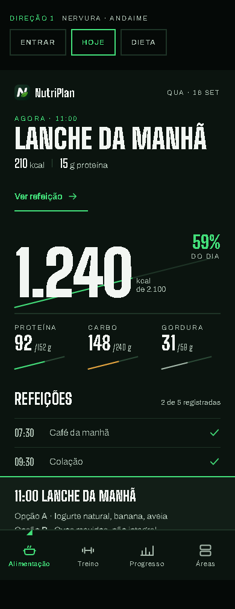
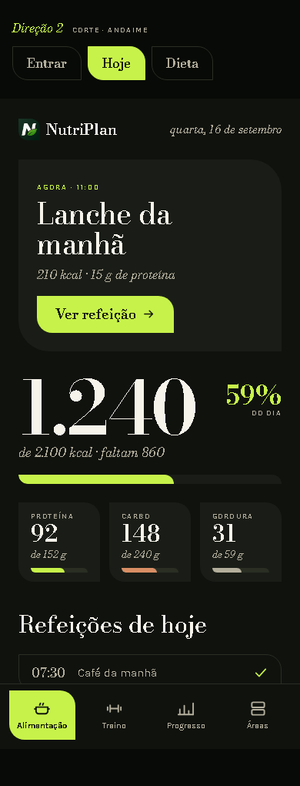
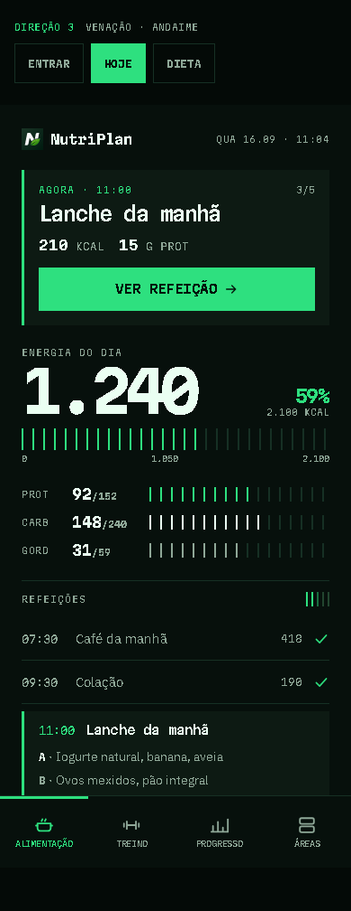
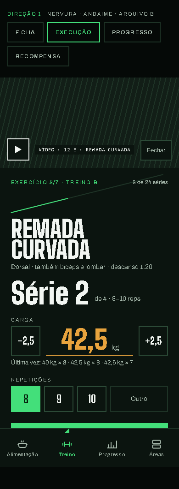
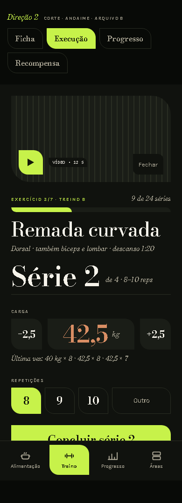
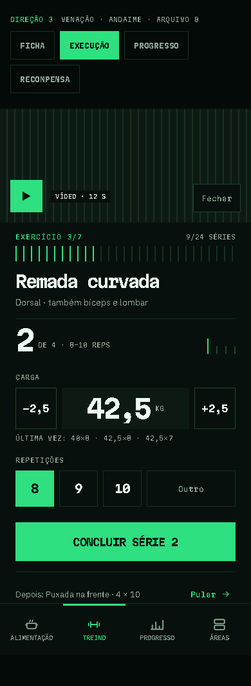
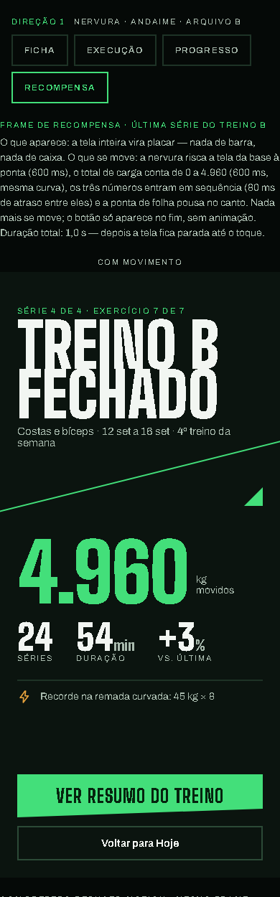
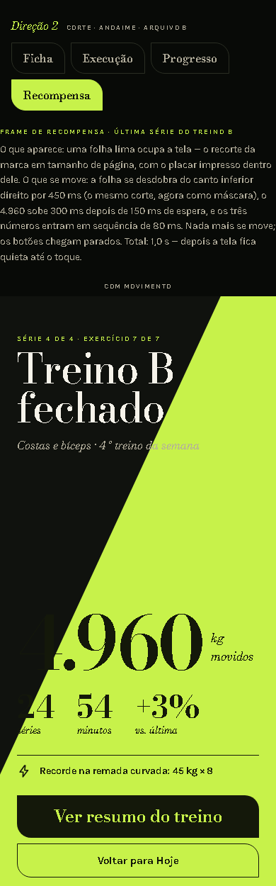
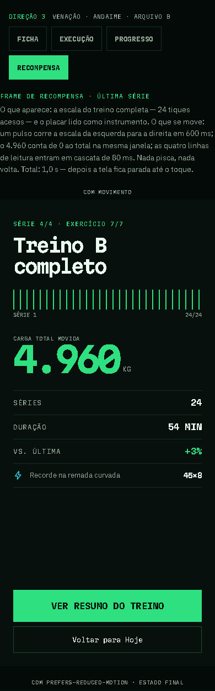

# Direção escolhida: **CORTE** (Direção 2) — 25 pontos em 30

Escolhida por mim em 16/09/2026, sem o dono olhar antes, pelo critério dele
(seis itens, 0 a 5, nesta ordem, com evidência nas capturas). O veto vem
depois, por este arquivo. As três direções foram propostas pelo Claude Design
(Opus 5 · Extra) a partir do brief "o Claude Design propõe, a spec se adapta"
(`../2026-09-15-chatgpt-claude-design/roteiro-tres-direcoes.md`); os arquivos
estão em `artifacts/claude-design/export/direcoes/` (fora do git) e o
comparativo completo — sete telas × dois temas × três direções — em
`scratchpad/shots-design/direcoes.html` na máquina de quem gerou.

## As três, lado a lado (escuro — o padrão)

| | 1 · NERVURA | 2 · CORTE | 3 · VENAÇÃO |
|---|---|---|---|
| fontes | Big Shoulders Display + Archivo | Bodoni Moda + Karla | Martian Mono + IBM Plex Sans |
| a folha vira | uma diagonal a 14° que é régua de tudo | o recorte de todo elemento (0 · 20 px · 0 · 20 px) | uma escala de tiques em cada métrica |
| Home |  |  |  |
| Execução |  |  |  |
| Recompensa |  |  |  |

## A tabela

| # | critério | NERVURA | CORTE | VENAÇÃO |
|---|---|:-:|:-:|:-:|
| 1 | identidade em 1 s (a folha como sistema) | 4 | **5** | 3 |
| 2 | número como herói a 390 px | **5** | 3 | 4 |
| 3 | execução + frame de recompensa | **5** | 4 | 3 |
| 4 | escuro padrão, claro derivado, AA | 4 | **5** | 3 |
| 5 | custo sobre o que existe | 3 | **4** | 2 |
| 6 | risco de envelhecer mal | 2 | **4** | 2 |
| | **total** | **23** | **25** | **17** |

Sem empate. O desempate previsto (critérios 1 e 3) também daria CORTE em 1
e NERVURA em 3 — a soma decide, e CORTE vence pelos dois critérios que
são estrutura (identidade e custo), não pelos que são gosto.

## A evidência, critério a critério

**1 · Identidade em 1 s.** Tampe o nome. NERVURA (4): a diagonal está em
todas as telas — atrás do login, na régua de calorias, nas mini-réguas dos
macros, na ponta da folha que marca a aba ativa — mas "condensada em caixa
alta, verde-neon sobre preto" é a cara de meia dúzia de apps de treino
(Nike Training, Freeletics, Gymshark); a folha aparece como *uma linha*,
e uma linha é de qualquer um. CORTE (5): o recorte 0/20/0/20 está em cada
botão, campo, chip, mídia e no frame de recompensa (uma folha-lima do
tamanho da tela); é a silhueta do logo repetida como forma — sem o nome,
ainda é o NutriPlan, e nenhum app de treino ou dieta usa didone sobre osso
com uma lima. VENAÇÃO (3): tiques e mono lembram painel de instrumento;
a ligação com a folha é conceitual (nervuras secundárias → escala) e não se
vê; poderia ser um app de finanças ou um terminal.

**2 · Número herói.** NERVURA (5): "1.240" em 76–104 px condensado ocupa a
largura sem quebrar, "42,5 kg" em laranja (`--carga`) é o maior objeto da
execução, macros com número + régua; hierarquia por tamanho e cor. CORTE
(3): "1.240" e "42,5 kg" em Bodoni são bonitos e grandes, mas didone não tem
numerais tabulares por padrão e os fios finos somem em tela de baixa
densidade abaixo de ~20 px — a lista "4 × 8–10" em serifa alinha mal em
coluna; Karla fica com os números pequenos (regra no DESIGN.md: Bodoni só
≥ 20 px, Karla `tabular-nums` no resto). VENAÇÃO (4): mono é tabular por
natureza e "1.240" é grande; mas 36 rótulos a 9–10 px (abaixo do piso de
11) e a régua de tiques compete com o número.

**3 · Execução + recompensa.** NERVURA (5): nome do exercício em caixa alta
gigante, "Série 2" como segundo herói, carga em laranja, um primário;
recompensa "TREINO B FECHADO" + 4.960 kg + 24/54/+3 % + recorde — cartaz de
vitória. CORTE (4): execução elegante e clara (Série 2, carga em argila,
chips de reps, "Concluir série 2" em lima); recompensa é a folha-lima
desdobrando com 4.960 dentro — a mais prazerosa das três — MAS na captura
o "4.960" sai cortado pela máscara da folha (".960"): defeito de mockup a
corrigir na implementação (o número nasce dentro da folha, não atrás). VENAÇÃO
(3): execução funcional, precisa, com "Depois: Puxada na frente" que é boa
ideia; recompensa é uma escala cheia e uma lista — satisfaz quem gosta de
dado, não celebra.

**4 · Escuro padrão, claro derivado, AA.** Medido nos tokens dos três
arquivos (`artifacts/contraste_direcoes.py`): todo par texto/fundo passa AA
nos dois temas — mínimo no claro 5,02 (VENAÇÃO acento/fundo-2), 5,48
(NERVURA), 5,71 (CORTE); no escuro tudo acima de 7. CORTE (5): o claro
"papel osso + oliva" mantém a identidade inteira e ganha uma segunda
personalidade (revista de cozinha) sem perder a primeira. NERVURA (4): o
claro mantém a diagonal e o condensado; o verde escuro sobre papel perde o
brilho de academia — coerente, menos forte. VENAÇÃO (3): tiques cinza sobre
branco viram planilha; é a que mais perde no claro.

**5 · Custo sobre o que existe.** O que sobrevive nas três: tokens (todas
escrevem `:root` com nomes próprios — renome de 32 cores), o sprite (as
três usam `<use href="#icone-…">`, 19–20 vezes cada), os `--mov-*` e o
`prefers-reduced-motion`, as catracas de valor cru (as três escrevem
`font-size` em px; entram por token como hoje). O que difere: CORTE (4) é
UM token de raio (`--corte: 0 20px 0 20px`) aplicado a `.btn`, `.field`,
`.chip`, mídia e cartão (59 `border-radius` no arquivo, zero `rotate`, zero
`clip-path` fora da máscara de mídia) — a estrutura de componentes da branch
fica, muda a pele; os cartões viram faixas de `--fundo-2` sem sombra, que é
tirar código. NERVURA (3): 15 `rotate` e 5 `clip-path` — cada componente
que mede ganha uma diagonal desenhada à mão, e o anel de progresso vira
outra coisa. VENAÇÃO (2): a escala de tiques substitui todo anel e barra e
o estado de cada tique (apagado/aceso/cheio) depende de o servidor contar
"26 tiques = 26 séries" — muda template e view em `plans/` e `workouts/`.

**6 · Envelhecer mal.** NERVURA (2): "atletismo brutalista" (condensada,
neon, preto) é a tendência de 2024–2026 e já está em todo lugar; em 2029
data a si mesma. VENAÇÃO (2): "terminal/instrumento" (mono, tiques, ciano)
é a estética de dev-tool de 2025–2026. CORTE (4): didone sobre papel é
editorial há um século; a lima é a única peça datável e é substituível
sem mexer no resto (é um token); o recorte da folha é proprietário — não
segue tendência porque é do logo.

## O que a implementação tem de corrigir do mockup

- rótulos a 10 px (12 ocorrências no arquivo `-a`) sobem para o piso de 11;
- número da recompensa nasce DENTRO da folha (o mockup deixou cortar);
- Bodoni só a partir de 20 px e só para o que é herói; todo número pequeno
  em Karla com `tabular-nums` e vírgula decimal;
- os `font-size` em px do mockup viram degraus da escala (catraca).

## O que continua valendo (as cinco restrições)

WCAG AA em todo par (274 pares medidos no CSS real); alvo ≥ 44 px em altura
E largura; tudo em token; `prefers-reduced-motion` desliga o movimento; o
sprite de traço 2 na grade 24; PWA de uma coluna com a barra de quatro.
